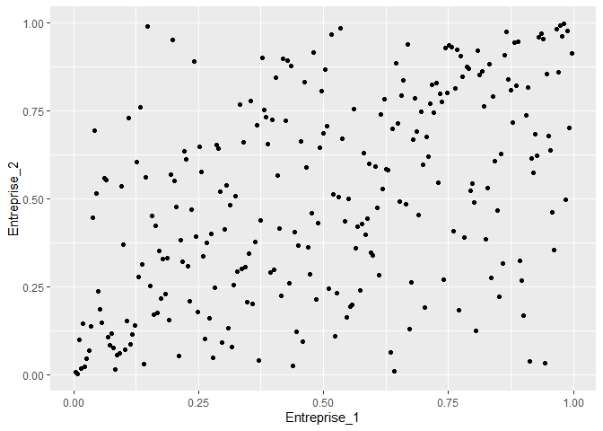

Risques multiples et application à la mesure du risque de crédit
================
Pierre Clauss
Avril 2023

*Ce document R Markdown a pour objet la résolution de l’exercice 8.1 du
cours.*

Pour déterminer la CreditVaR à 1 an, j’ai besoin de données sur les 3
paramètres de risque de crédit que sont la PD, la LGD et la dépendance
entre créances.

Le nominal est le même pour chaque créance.

``` r
Nominal = 1000
```

## 1 Paramètres de risque de crédit

### 1.1 PD

J’utilise les primes de CDS fournies dans l’énoncé pour en extraire les
PD implicites.

``` r
PD1 = 1 - exp(-300 / 10000 / 0.6)
PD2 = 1 - exp(-50 / 10000 / 0.6)
```

La PD implicite de l’entreprise 1 est égale à 4.88% et celle de
l’entreprise 2 est égale à 0.83%.

### 1.2 LGD

J’utilise les moyennes et écart-types des pertes en cas de défaut
fournies dans l’énoncé pour en estimer les paramètres des lois Beta
associées.

``` r
mu1 = 0.32
sigma1 = 0.41
a1 = ((mu1 ^ 2) * (1 - mu1)) / (sigma1 ^ 2) - mu1
b1 = ((mu1 ^ 2) * ((1 - mu1) ^ 2)) / (mu1 * (sigma1 ^ 2)) - (1 - mu1)

mu2 = 0.68
sigma2 = 0.33
a2 = ((mu2 ^ 2) * (1 - mu2)) / (sigma2 ^ 2) - mu2
b2 = ((mu2 ^ 2) * ((1 - mu2) ^ 2)) / (mu2 * (sigma2 ^ 2)) - (1 - mu2)
```

La LGD de la première créance peut être modélisée par une loi
Beta(0.09,0.2) et celle de la seconde créance par une loi
Beta(0.68,0.32).

### 1.3 Dépendance des défauts

A partir du modèle de Merton, j’utilise les rentabilités des actions
pour modéliser la structure de dépendance entre les défauts.

J’importe ces rentabilités du fichier Excel fourni à l’aide du package
**readxl** et de sa fonction `read_xlsx()`.

``` r
library(tidyverse)
library(readxl)
(renta <- read_xlsx(
  "data.xlsx",
  sheet = "CreditVaR",
  skip = 1,
  col_names = c("Entreprise_1", "Entreprise_2")
))
```

    ## # A tibble: 261 × 2
    ##    Entreprise_1 Entreprise_2
    ##           <dbl>        <dbl>
    ##  1   -0.00796       0.00914 
    ##  2    0.0380        0.00668 
    ##  3   -0.00492      -0.0199  
    ##  4    0.0307        0.0158  
    ##  5    0.0000163    -0.0145  
    ##  6   -0.00651       0.000404
    ##  7   -0.00701       0.0151  
    ##  8   -0.00445      -0.0220  
    ##  9    0.00415      -0.00175 
    ## 10   -0.00994      -0.0134  
    ## # … with 251 more rows

Les données sont simulées et tidy donc il n’y a pas de démêlage à
réaliser.

Observons le dépendogramme de la copule empirique associée à ces deux
séries de rentabilités.

``` r
library(copula)
ggplot(data = as_tibble(pobs(renta)),
       mapping = aes(x = Entreprise_1, y = Entreprise_2)) +
  geom_point()
```

<!-- -->

Nous pouvons estimer 2 copules paramétriques : la copule Gaussienne et
la copule Student.

``` r
set.seed(1234)
correl_normal <- summary(fitCopula(normalCopula(), pobs(renta), method = "mpl"))$coefficients[1, 1]
gof_normal <- gofCopula(normalCopula(), pobs(renta), N = 50)$p.value

esti <- summary(fitCopula(tCopula(), pobs(renta), method = "mpl"))$coefficients
correl_t <- esti[1, 1]
degre <- esti[2, 1]
gof_t <- gofCopula(tCopula(df = 4, df.fixed = T), pobs(renta), N = 50)$p.value
```

La copule Gaussienne a pour paramètre la corrélation estimée par Maximum
de Vraisemblance égale à 0.54. Un test statistique d’adéquation à cette
copule donne une p-value de 53.92%.

La copule Student a pour paramètres la corrélation estimée par Maximum
de Vraisemblance égale à 0.53 et le degré de liberté égal à 3.49. Un
test statistique d’adéquation à cette copule donne une p-value de
83.33%.

## 2 CreditVaR par simulations Monte-Carlo

Je peux maintenant déterminer la CreditVaR par simulations Monte-Carlo
suivant 3 copules : produit, Gaussienne et Student.

Je réalise 1 million de simulations de pertes.

``` r
n <- 1e6
```

``` r
u1 <- runif(n)
u2 <- runif(n)
L1 <- (u1 < PD1) * rbeta(n, a1, b1) * Nominal
L2 <- (u2 < PD2) * rbeta(n, a2, b2) * Nominal
L = L1 + L2
CreditVaR = quantile(L, 0.999)
```

En modélisant la structure de dépendance par une copule produit, la
CreditVaR à 1 an à 99.9% est égale à 1000.

``` r
rcop <- rCopula(n, normalCopula(correl_normal))
u1 <- rcop[, 1]
u2 <- rcop[, 2]
L1 <- (u1 < PD1) * rbeta(n, a1, b1) * Nominal
L2 <- (u2 < PD2) * rbeta(n, a2, b2) * Nominal
L = L1 + L2
CreditVaR = quantile(L, 0.999)
```

En modélisant la structure de dépendance par une copule Gaussienne, la
CreditVaR à 1 an à 99.9% est égale à 1143.

``` r
rcop <- rCopula(n, tCopula(param = correl_t, df = degre))
u1 <- rcop[, 1]
u2 <- rcop[, 2]
L1 <- (u1 < PD1) * rbeta(n, a1, b1) * Nominal
L2 <- (u2 < PD2) * rbeta(n, a2, b2) * Nominal
L = L1 + L2
CreditVaR = quantile(L, 0.999)
```

En modélisant la structure de dépendance par une copule Student, la
CreditVaR à 1 an à 99.9% est égale à 1537.
